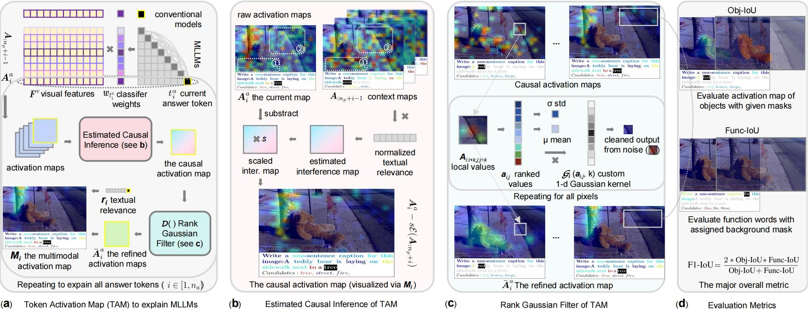

# Token Activation Map to Visually Explain Multimodal LLMs
[ICCV 2025 Oral] We introduce the Token Activation Map (TAM), a groundbreaking method that cuts through the contextual noise in Multimodal LLMs. This technique produces exceptionally clear and reliable visualizations, revealing the precise visual evidence behind every word the model generates.

[](https://arxiv.org/abs/2506.23270)



(a) The overall framework of TAM. (b) Details of the estimated casual inference module. (c) Details of the rank Gaussian filter module. (d) Fine-grained evaluation metrics.

### Installation
* python packages:
```
pip install -r requirements.txt
```
* latex for text visualization:
```
sudo apt-get update
sudo apt-get install texlive-xetex
```

### Demo
* A demo for qualitative results
```
python demo.py
```
Note: The demo supports both image and video inputs; update the inputs accordingly for other scenarios.


### Eval
* Download the formatted datasets for eval at [[COCO14+GranDf+OpenPSG](https://hkustconnect-my.sharepoint.com/:u:/g/personal/ylini_connect_ust_hk/EXL-stkCxk5DnwRkNw9MgSABu1vFPv_0FI60yxl0OYxSGQ?e=V3qjHh)] or [huggingface](https://huggingface.co/datasets/yili7eli/TAM/tree/main).
* Evaluation for quantitative results
```
# python eval.py [model_name] [dataset_path] [vis_path (visualize if given)]

python eval.py Qwen/Qwen2-VL-2B-Instruct data/coco2014
```
Note: Results may vary slightly depending on the CUDA, device, and package versions.


### Custom model
* Step1: load the custom model
* Step2: get the logits from transformers
```
outputs = model.generate(
    **inputs,
    max_new_tokens=256,
    use_cache=True,
    output_hidden_states=True, # ---> TAM needs hidden states
    return_dict_in_generate=True
)
logits = [model.lm_head(feats[-1]) for feats in outputs.hidden_states]
```
* Step3: prepare input args
```
# used to split tokens
# note: 1. The format is [int/list for start, int/list for end].
#       2. The select tokens are [start + 1: end].
#       3. The start list uses the idx of last token, while end uses the first.

special_ids = {'img_id': [XXX, XXX], 'prompt_id': [XXX, XXX], 'answer_id': [XXX, XXX]}

# output vision map shape (h, w)
vision_shape = (XXX, XXX)
```
* Step4: run TAM() to vis each token
```
# Call TAM() to generate token activation map for each generation round
# Arguments:
# - token ids (inputs and generations)
# - shape of vision token
# - logits for each round
# - special token identifiers for localization
# - image / video inputs for visualization
# - processor for decoding
# - output image path to save the visualization
# - round index (0 here)
# - raw_vis_records: list to collect intermediate visualization data
# - eval only, False to vis
# return TAM vision map for eval, saving multimodal TAM in the function

raw_map_records = []
for i in range(len(logits)):
    img_map = TAM(
        generated_ids[0].cpu().tolist(),
        vision_shape,
        logits,
        special_ids,
        vis_inputs,
        processor,
        os.path.join(save_dir, str(i) + '.jpg'),
        i,
        raw_map_records,
        False)
```
* Note: see detailed comments in tam.py about TAM()


## LICENSE
This project is licensed under the MIT License.

## Citation
```
@misc{li2025tokenactivationmapvisually,
      title={Token Activation Map to Visually Explain Multimodal LLMs}, 
      author={Yi Li and Hualiang Wang and Xinpeng Ding and Haonan Wang and Xiaomeng Li},
      year={2025},
      eprint={2506.23270},
      archivePrefix={arXiv},
      primaryClass={cs.CV},
      url={https://arxiv.org/abs/2506.23270}, 
}
```

